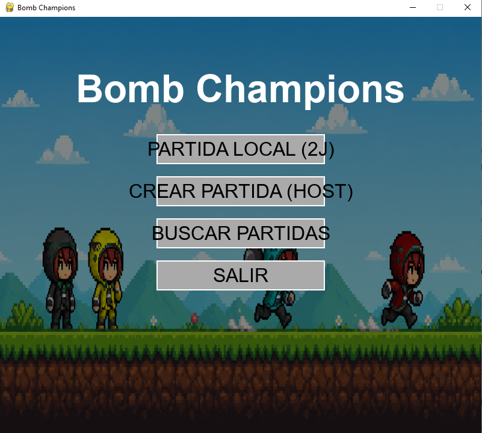
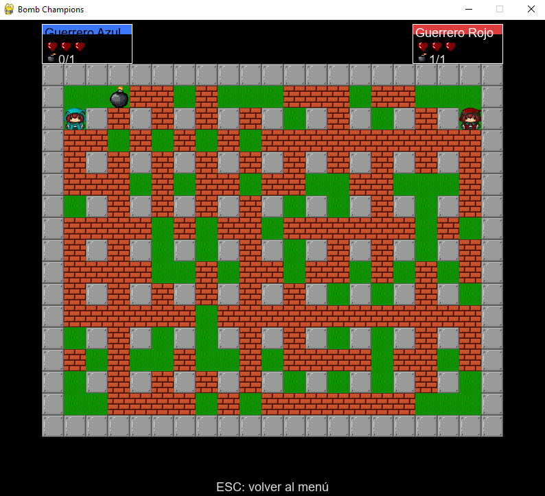

# Bomb Champions

**Un juego multijugador estilo Bomberman desarrollado con Python y Pygame** — partidas locales a 2 jugadores y por LAN con campeones, bombas y habilidades especiales. Proyecto intermodular de fin de ciclo a dos personas para el grado SMR.

> **Idioma:** Español | [English](README.md)

---

## Contexto del proyecto

|              |                                                                          |
| ------------ | ------------------------------------------------------------------------ |
| **Autores**  | Miguel Eduardo Marcano Ordaz (programación y arquitectura) y Gabriel Alejandro Celis Ordaz (diseño gráfico, audio y personajes) |
| **Contexto** | *Proyecto Intermodular* (TFG) — Técnico en Sistemas Microinformáticos y Redes (SMR), IES El Álamo, Madrid — **nota final: 9** |
| **Tutor**    | Raúl Bernabé Sebastián                                                   |
| **Año**      | 2026                                                                     |
| **Tipo**     | Proyecto académico a dos personas                                         |

---

## Capturas de pantalla



*Menú principal — partida local a 2 jugadores y opciones LAN*



*Partida en curso con HUD (vidas, bombas) de ambos jugadores*

---

## Descripción general

Bomb Champions es un juego de arena estilo Bomberman escrito en Python con Pygame. Los jugadores colocan bombas para destruir muros y eliminar oponentes en un mapa basado en tiles. Soporta partidas locales a 2 jugadores y multijugador por LAN con sincronización autoritativa del host. Fue desarrollado por un equipo de dos personas y entregado como proyecto intermodular del ciclo SMR (nota 9).

---

## Características

- Partidas locales a 2 jugadores (teclado compartido) y multijugador por LAN en red
- Campeones seleccionables con habilidades especiales
- Bombas y explosiones en cadena en un mapa basado en tiles
- HUD por jugador (vidas, bombas disponibles, cooldown de especial) en cada esquina del mapa
- 3 vidas por jugador con invulnerabilidad temporal tras recibir un golpe
- Sincronización LAN autoritativa del host con predicción del cliente y correcciones

---

## Requisitos

- Python 3.10 o superior
- pygame

---

## Primeros pasos

### Instalación

```powershell
cd path\to\BombChampions
python -m venv .venv
.\.venv\Scripts\Activate.ps1
pip install -r requirements.txt
```

### Ejecutar el juego

**Forma más sencilla:** doble clic en `ejecutar.bat`, o en PowerShell:

```powershell
.\ejecutar.ps1
```

Desde la carpeta del proyecto (si prefieres ejecutarlo manualmente):

```powershell
.\.venv\Scripts\python.exe main.py
```

> En Windows, el comando `python` del sistema a menudo no está configurado; usa los scripts anteriores o la ruta del `.venv`.

### Assets

El juego espera estas imágenes en `assets/`:

- `Pasto.png`
- `ParedHierro.gif`
- `ParedLadrillos.png`
- `CORAZON.png` (icono de vida en el HUD)
- `Bomba.png` (spritesheet 3×4, 10 frames; el primer frame es el icono del HUD)
- `EXPLOCION.png` (spritesheet 1×5, 5 frames de explosión)

Los archivos `.piskel` en `assets/` son los sprites originales. Expórtalos desde [Piskel](https://www.piskelapp.com/) como PNG con esos nombres, o el mapa se dibujará con cuadrados rojos de respaldo.

---

## Controles

Antes de cada partida (local o LAN) eliges **Flechas** o **WASD**. El layout en pantalla muestra el mapa de teclas de cada opción.

| Esquema   | Movimiento | Bomba | Especial    |
| --------- | ---------- | ----- | ----------- |
| Flechas   | ↑ ↓ ← →    | Espacio | Left Shift |
| WASD      | W A S D    | E     | Q           |

- **Partida local (2P):** cada jugador elige por turnos; uno debe usar Flechas y el otro WASD.
- **Partida LAN:** cada jugador elige en su propio PC (la red solo envía direcciones, no códigos de tecla).

Cada jugador tiene **3 vidas** por partida. Al recibir un golpe pierde una vida, queda invulnerable unos segundos (el personaje parpadea) y permanece en el mismo sitio; cuando se agotan las vidas, queda eliminado. El HUD en la esquina del mapa de cada jugador muestra corazones, bombas disponibles y cooldown del especial.

---

## Estructura del proyecto

| Archivo              | Descripción                                              |
| -------------------- | -------------------------------------------------------- |
| `main.py`            | Menús, gameplay local y LAN                              |
| `hud.py`             | HUD en juego (vidas, bombas, especial por esquina)       |
| `configuracion.py`   | Todas las constantes (juego, teclas, red)                |
| `mapa.py`            | Generación y renderizado del mapa                        |
| `campeones.py`       | Definiciones de campeones y clase Player                 |
| `bomba.py`           | Bombas y explosiones                                     |
| `especiales.py`      | Habilidades (p. ej. cuchillas CuchillasPJ)              |
| `red_descubrimiento.py` | Descubrimiento/anuncio de partidas LAN por UDP        |
| `red_partida.py`     | Conexión host/cliente TCP (lobby + sincronización)       |

---

## Multijugador LAN

1. **Host:** menú → CREATE GAME → elige un campeón → comparte la IP mostrada en pantalla → espera jugadores → **START GAME** (mínimo 2).
2. **Cliente:** menú → FIND GAMES → clic en un lobby → elige un campeón → espera a que el host inicie.
3. Si no aparecen lobbies, comprueba que ambos PCs estén en la misma red Wi‑Fi y permite Python en el firewall (red privada).

**Sincronización:** el host es autoritativo. Los clientes predicen su movimiento; el host envía eventos `mov`/`correccion`, snapshots de posición cada **50 ms** (`pos`) y una sincronización completa (mapa + bombas) cada **2 s** como respaldo. Al final de cada paso de tile se envía una corrección con posición en píxeles para alinear animaciones.

---

## Equipo y roles

*Proyecto Intermodular* a dos personas, desarrollado en conjunto y coordinado mediante Git.

| Miembro                          | Responsabilidades                                                                                                                                 |
| -------------------------------- | ------------------------------------------------------------------------------------------------------------------------------------------------- |
| **Miguel Eduardo Marcano Ordaz** | Programación y arquitectura — estructura modular, gameplay (mapa, jugadores, bombas), diseño orientado a objetos y red LAN (descubrimiento UDP + sincronización TCP host/cliente) |
| **Gabriel Alejandro Celis Ordaz**| Diseño gráfico y assets (sprites Piskel, tiles, bombas, explosiones, iconos HUD), audio retro (BeepBox) y diseño de personajes campeones        |

---

## Desarrollo asistido por IA

Este proyecto usó **desarrollo asistido por IA** como parte deliberada del flujo de trabajo. Pygame y la red basada en sockets eran nuevos para el equipo, así que los asistentes de IA ayudaron a entender errores, explorar APIs desconocidas, estructurar el intercambio de datos TCP y apoyar el trabajo de assets y documentación. Todo lo sugerido se revisó, probó en el juego y adaptó a los archivos del proyecto — el objetivo era aprender más rápido y validar el resultado, no copiar a ciegas. Saber *qué* preguntar, comprobar la salida y asumir responsabilidad del código entregado es la habilidad relevante.

---

## Autor

**Miguel Eduardo Marcano Ordaz** — desarrollado con mi hermano, **Gabriel Alejandro Celis Ordaz**.

|          |                                                                                           |
| -------- | ----------------------------------------------------------------------------------------- |
| GitHub   | [github.com/memomiguel](https://github.com/memomiguel)                                    |
| LinkedIn | [Miguel Eduardo Marcano Ordaz](https://www.linkedin.com/in/miguel-eduardo-marcano-ordaz/) |
| Email    | [memomiguel@proton.me](mailto:memomiguel@proton.me)                                       |

---

## Licencia

Publicado bajo la **Licencia MIT**. Consulta [LICENSE](LICENSE) para más detalles.
